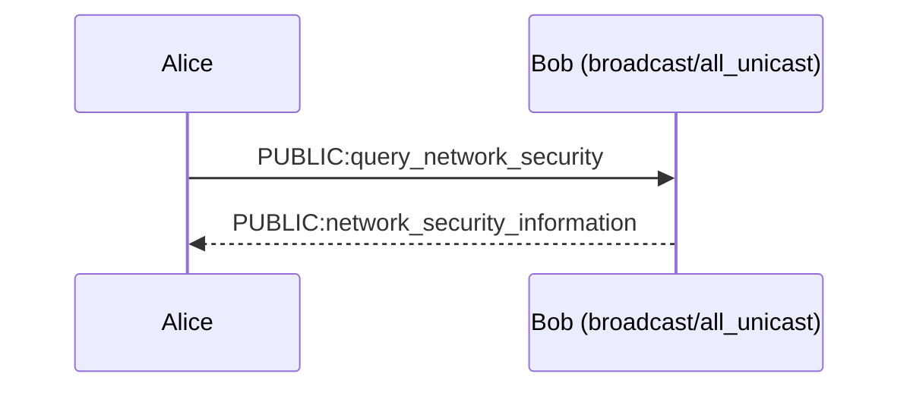
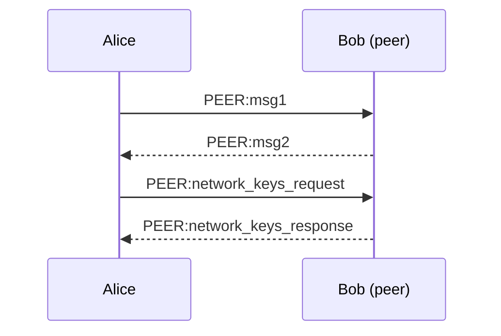

# Behavior Definitions

## [Node] Node
### [Node.PeerCreationAndDeletion] Peer Creation and Deletion
 Peer Creation:
 * Peer is created only when a node receives a beacon from any of its transports.
 * Beacons are sent every `beacon_interval_ms` (default 500ms).
 * BTP messages from an unknown source do not create a peer; they are ignored until a beacon arrives.
 * Node maintains per-link statistics (`last_activity_time_s`, recv pkt/byt) for every `(port, address)` where the peer is observed, separately for unicast and multicast links.
 * Peer `last_activity_time_s` is updated on any observed activity from that peer (including beacons).

 Peer Deletion:
 * Activity is checked every `check_peer_activity_interval_ms` (default 500ms).
 * Peer is deleted when no activity is detected for `default_peer_timeout_s` (default 3s, ~6 beacon intervals).
 * On deletion the node:
   * Cancels the peer transaction timer and any peer security-context timers.
   * Aborts the current transaction and all pending transactions with `E_PEER_TRANSACTION_STATUS_PEER_TEARDOWN` without starting pending work.
   * Finishes any in-flight peer security or network-key acquisition procedure once with `PEER_TEARDOWN`.
   * Clears peer security contexts.
   * Removes the peer from the network-key acquisition candidate list and clears it as the ongoing acquisition peer if applicable.

### [Node.NetworkKeyAcquisition] Network Keys Acquisition
Node will initially run `query_network_security` to discover peers' advertised network security contexts.

If `node.network.network_key_seeder` is set and the node has no network keys yet, it seeds a local network key before acquisition.

If no peers exist yet when acquisition starts, the procedure defers and rearms every `node.network.query_network_security_retry_timeout_s` (default 6s) until at least one peer is present, then sends the public query. The procedure runs one query+acquire cycle and then completes (even if no keys were installed). A later trigger (for example an unrecognized NETWORK `sec_ctx` after a missed key refresh) may start a new independent procedure.

**Querying public network security information**

* Alice sends `QUERY_NETWORK_SECURITY` as a PUBLIC message on beacon destinations and to known peers' preferred addresses.
* Every node that receives `QUERY_NETWORK_SECURITY` responds with `NETWORK_SECURITY_INFORMATION` only when it has at least one network security context to advertise; empty replies are not sent.
* Alice collects responses for `node.network.security_query_timeout_ms`.
* `NETWORK_SECURITY_INFORMATION` is advisory only and is not used for conflict resolution.
* Collected advertisements become acquisition candidates (peer id + `sec_ctx` + priority + expiration). Expired advertisements and peers that no longer exist are dropped.

**Querying private network security information**

* After the query window, Alice acquires keys from candidate peers one at a time, preferring the peer that advertised the most contexts.
* If peer security is not yet usable, Alice establishes it first (`MSG1`/`MSG2`); otherwise peer security establishment is skipped.
* Alice sends `NETWORK_KEYS_REQUEST` over the PEER channel; Bob replies with `NETWORK_KEYS_RESPONSE` only when it has installed network keys. If Bob has none, it does not send a response.
* Received keys are installed via conflict resolution.
* The node may acquire from one or more peers until candidates are satisfied or exhausted.

**Network Security Conflict Resolution**

Conflict occurs when installing a key for a `sec_ctx` that already exists with a different expiration time and/or priority.
Preference order (`key_preference_is_better`):
1. Non-expiring key beats an expiring key.
2. Otherwise the older key wins (smaller `expiration_time_s`).
3. Otherwise the higher `priority` wins.

A key is treated as expiring when `expiration_time_s` is less than `security_ctx_grace_period_s` (default 30s) from the current time.

Conflict resolution is applied when installing keys from `NETWORK_KEYS_RESPONSE` or `NETWORK_KEY_REFRESH`.

Each installed network security context tracks local RX integrity stats:
* `integrity_success` — count of NETWORK frames accepted under that context
* `integrity_failure` — count of NETWORK frames rejected for MAC failure under that context

Both counters reset when the context is installed or replaced.

Triggers:
* On startup (`initialize`)
* On NETWORK RX when the security context is unrecognized
* On NETWORK RX when the context is recognized, integrity verification fails, and `integrity_success` is still 0 (never proven working)
* On NETWORK TX when the context is not available

When a recognized context already has `integrity_success > 0` and integrity verification fails, the frame is dropped and network security acquisition is not started.

### [Node.NetworkKeyRefresh] Network Key Refresh
`node.network.key_refresh_interval_s` is a mandatory periodic broadcast: when the node has one or more network keys, it sends them (`NETWORK:network_key_refresh`) on that interval as a NETWORK frame with broadcast destination and TTL 0, on configured beacon destinations (multicast beacons and static-unicast peers).

The frame is protected with the selected network `sec_ctx` integrity algorithm and key. Receivers that already possess that context verify the MAC and may install/update advertised keys via conflict resolution. Nodes that lack the context cannot participate on NETWORK; they drop the frame and run network security acquisition instead. Refresh is not a bootstrap path for missing network keys.

Triggers:
* Timer

### [Node.Security] Network Security
**Key selection**