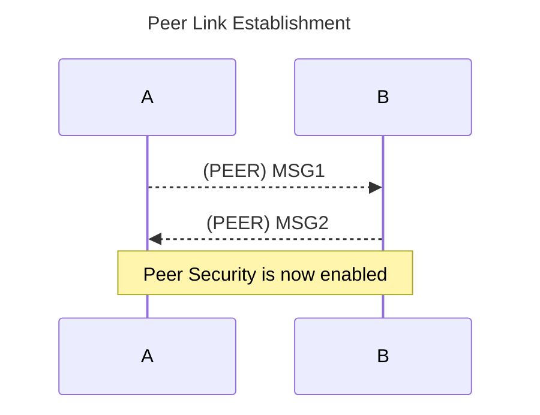
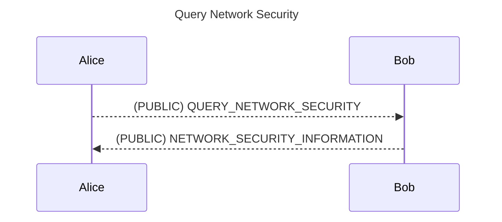
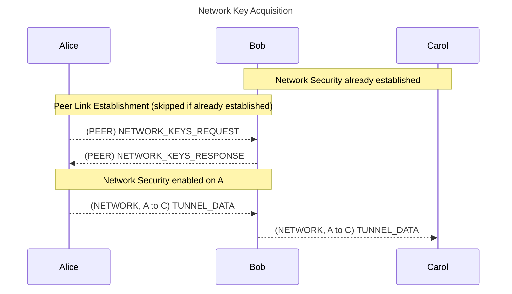
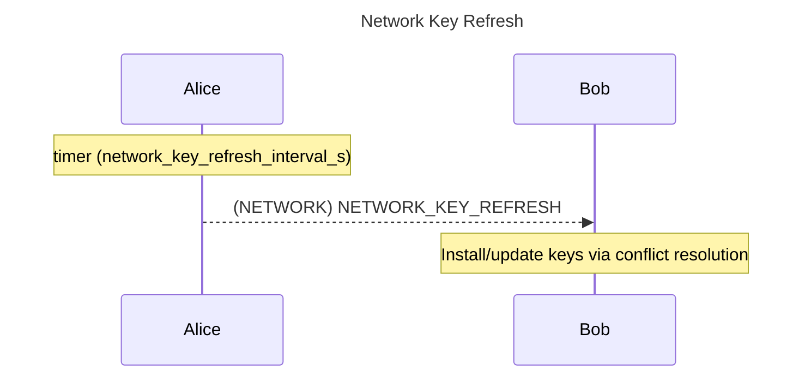

# BFC Tunneling Protocol

##  [Core] Core

### [Core.Overview] Overview

---

### [Core.Overview.Mesh] Mesh

---

A **node** is a participant in the overlay, identified by a **NodeID** within the shared address space.

A **mesh** is the set of connections among nodes established by preconfigured transports. The transport can be unicast or multicast transports.

The overlay comprises two complementary meshes. The **multicast transport mesh** links nodes reachable over multicast-like networks. The **unicast transport mesh** links nodes reachable over unicast UDP. A node may bridge the two meshes.

Each node terminates and relays overlay traffic. Reachability and path propagation across meshes use a distance-vector model with split horizon and poison reverse to limit routing loops and propagate withdrawals.

---

### [Core.Overview.Transport] Transport

---

Multicast and unicast transport use different media but are equivalent for **BFC Tunnel Frame (BTF)** carriage and forwarding. **BTF** may traverse any reachable overlay path regardless of hop medium. Multicast links may apply link-specific outer encapsulation (for example, WLAN broadcast frames, radio PHY payloads, or UDP IGMP) without changing **BTF** semantics.

* **Multicast Transport** carries **BTF** across the **multicast transport mesh** over local broadcast or equivalent shared-medium links.
    * **WiFi injection** — the **BTF** occupies the 802.11 data frame body with the destination address set to broadcast. **Implementations** include *WInject-direct*, *wifibroadcast*, and *WFB-NG*.
    * **SDR, Zigbee, and LoRa** — **BTF** is carried as the PHY payload (L2-equivalent). Radio management uses BTP RRC or manual configuration (implementation-defined).
    * **UDP IGMP** — **BTF** is the UDP payload. Multicast group and port are implementation-defined.
* **Unicast Transport** carries **BTF** across the **unicast transport mesh** over ordinary **IPv4** or **IPv6** paths.

---

## [Core.Framing] Framing

### [Core.Framing.BTF] BFC Tunnel Frame
| Size | Type  | Field         | Description                          | Notes |
|------|-------|---------------|--------------------------------------|-------|
| 1    | `u8`  | `ttl`         | Time-to-live                         |       |
| 1    | `u1`  | `reserved`    | Reserved                             |       |
| -    | `u5`  | `version`     | Protocol Version                     |       |
| -    | `u2`  | `frame_type`  | Frame Type                           |       |
| 1    | `u4`  | `sec_ctx`     | Security Context                     |       |
| -    | `u4`  | `mac_size`    | MAC size in 32-bit unit              |       |
| x    | `ux`  | `mac`         | Message Authentication Code          | [1]   |
| 4    | `u32` | `sn`          | Sequence Number                      |       |
| 4    | `u32` | `ts`          | Epoch Second                         |       |
| 4    | `u32` | `src`         | Source NodeId                        |       |
| 4    | `u32` | `dst`         | Destination NodeId                   |       |
| 1    | `u8`  | `type`        | Payload Type                         |       |
| N    | `u8[]`| `payload`     | Payload                              |       |

***notes***<br/>
***1. x = mac_size\*4***

---

**Frame Types**

Frame types include *Peer*, which is used in bootstrapping network configuration and security and is not routable; *Network*, which is used for routing and data delivery; *Network-over-peer* which allows a node to pass a secured message through a peer when network security is not yet available; and *Public*, which is used for node beacon messages.

| Value | Name              | Description |
|-------|-------------------|-------------|
| 0     | PEER              | Message intended for direct distination (i.e: TTL==1, next_hop==target)|
| 1     | NETWORK           | Message intended for the network.|
| 2     | NETWORK_OVER_PEER | Message intended for the network delegated by a peer. Payload is a NETWORK frame.|
| 3     | PUBLIC            | Message intended for public. |

### [Core.Framing.BTF.fields] Fields
Fields are encoded in network byte order (big-endian). Bit-fields that share a byte are packed most-significant-bit first as shown in the table.

- `ttl` is decremented by each forwarding hop; frames reaching `ttl = 0` MUST be dropped.
- `reserved` is reserved for future use and MUST be set to zero on transmission.
- `version` MUST match the negotiated protocol version.
- `frame_type` selects the frame interpretation (see Frame Types).
- `sec_ctx` selects the security context.
- `mac_size` is the MAC length in 32-bit units; MAC occupies `mac_size * 4` bytes.
- `mac` is the message authentication code for the frame.
- `sn` and `ts` provide replay-window and freshness inputs.
- `src` and `dst` are overlay Node IDs used for routing and policy checks.
- `type` selects the payload interpretation (see Message Types).
- `payload` is the PER-encoded message body for the selected `type`, or the ciphertext thereof when confidentiality protection is active.

---

## [Core.Flows] Flows

### [Core.Flows.PeerLinkEstablishment] Peer Link Establishment

---

Each node in the overlay network maintains public keys for all the other nodes in the nework if it wish to bootstrap through them. It is used for key exchange to generate keys for peer security.  



---

### [Core.Flows.NetworkKeyAcquisition] Network Key Acquisition

---

A node first discovers which peers advertise network security contexts via a public query, then fetches the private keys over an established peer-secure channel.

**Public network security discovery**



Every node that receives `QUERY_NETWORK_SECURITY` MUST reply with `NETWORK_SECURITY_INFORMATION`.
`NETWORK_SECURITY_INFORMATION` is advisory metadata only and MUST NOT be used for conflict resolution.

Initial discovery responses select which peer(s) to contact for private key acquisition. The node MAY perform peer network key acquisition from one or more peers.

**Private network key acquisition**



If peer security is already established, MSG1/MSG2 MAY be skipped before `NETWORK_KEYS_REQUEST`.

**Acquisition triggers**

* On startup
* On NETWORK RX when the security context is unrecognized
* On NETWORK RX when the context is recognized but integrity verification fails
* On NETWORK TX when no usable security context is available

### [Core.Flows.NetworkKeyRefresh] Network Key Refresh

---

A node periodically (`node.network_key_refresh_interval_s`) advertises its active network keys with `NETWORK_KEY_REFRESH` on NETWORK frames.



**Refresh triggers**

* Timer

---
## [Core.BasicSecurity] Security

### [Core.BasicSecurity.Peer] Peer Security
---

Peer security establishes the keys used for confidentiality and integrity protection, and its algorithms used as well.
It follows key Noise_KK_25519 for the key exchange.
Mutual authentication is inherent in the KK pattern because each node holds the peer's static public key; session keys derived from the handshake are only usable when both parties know the matching static private keys.
MSG1 and MSG2 carry no separate signature fields.
MSG1 will be sent in plaintext (`sec_ctx` is `NONE`).
MSG2 will be sent in accordance with MSG1. Peer security context is indexed by (n1, n2).
n1 and n2 are node ids for initiator and responser (either of which), where n2 > n1.

Each peer security context carries an absolute `expiration_time_s` set from node config at handshake time.
At 30 seconds before expiration the context is marked expiring and a new handshake is started so a replacement context can overlap.
Contexts with more than 30 seconds remaining are preferred; an expiring context is used only when no fresher context is available.
The expiring context is removed at its expiration time.

In local broadcast transport it is possible to have concurrent MSG1 from n1 and n2,
in this case the later MSG1 should be cancelled to let the earlier MSG1 complete the handshake. 

**Key Exchange Handshake**

```mermaid
---
config:
  theme: redux-color
---
sequenceDiagram
title Key Exchange
  participant A as Alice
  participant B as Bob

  Note over A,B:   A = Alice's Public Key
  Note over A,B:   B = Bob's Public Key
  Note over A:     a = Alice's Private Key
  Note over A: dh_aB = DH(a, B) 
  Note over B:     b = Bob's Private Key
  Note over B: dh_Ab = DH(A, b) 

  Note over A: Generate Alice Ephemeral Keys

  Note over A: e = Alice's Private Ephemeral Key
  Note over A: dh_eB = DH(e, B) 

  A -->> B: Msg1(E)
  Note over B: E = Alice's Public Ephemeral Key
  Note over B: dh_Eb = DH(E, b) 
  Note over B: dh_Ef = DH(E, f) 

  Note over A,B: dh_eB == dh_Eb == dh_eb
  Note over A,B: dh_aB == dh_Ab == dh_ab

  Note over B: Generate Bob Ephemeral Keys
  Note over B: f = Bob's Private Ephemeral Key
  Note over B: dh_Af = DH(A, f) 

  B -->> A: Msg2(F)
  Note over A: F = Bob's Public Ephemeral Key
  Note over A: dh_eF = DH(e, F) 
  Note over A: dh_aF = DH(a, F) 

  Note over A,B: dh_eF == dh_Ef == dh_ef
  Note over A,B: dh_Af == dh_aF == dh_af

  Note over A,B: Calculate Mix Key

  Note over A,B: ck0 = HASH(HASH(HASH("BTF") || A) || B)
  Note over A,B: ck1 = MixKey(ck0, dh_eb)
  Note over A,B: ck2 = MixKey(ck1, dh_ab)
  Note over A,B: ck3 = MixKey(ck2, dh_ef)
  Note over A,B: ck4 = MixKey(ck3, dh_af)
  Note over A,B: ks, kr = HKDF(ck4, 0, 2)
  ```

### [Core.BasicSecurity.Network] Network Security

---

Network security protects NETWORK and NETWORK_OVER_PEER frames with a shared security context (`sec_ctx`).
Each context carries integrity and confidentiality keys, a priority, and an absolute expiration time.

**Conflict resolution**

Conflict occurs when multiple candidates exist for the same `sec_ctx` with differing expiration time and/or priority.
The oldest non-expiring key with the highest priority wins.
A key is treated as expiring when `expiration_time_s` is less than 30 seconds from the current time.

Receivers apply conflict resolution when installing keys from `NETWORK_KEYS_RESPONSE` or `NETWORK_KEY_REFRESH`.

## [Core.Messages] Messages

### [Core.Messages.MessageDefinition] Message Definition

---

**Beacon**

Sent on all transport types to identify active neighboring nodes.

| Size | Type  | Field   |
|------|-------|---------|
| 1    | `u8`  | flags   |

`flags` is reserved; set to 0. Network key presence is discovered via
`query_network_security` / `network_security_information`, not the beacon.

---

**Msg1**

| Size | Type  | Field                     |
|------|-------|---------------------------|
| 1    | `u8`  | id                        |
| 1    | `u8`  | sec_ctx                   |
| 1    | `u8`  | integrity_algorithm       |
| 1    | `u8`  | confidentiality_algorithm |
| 1    | `u8`  | dh_key_type               |
| 1    | `u8`  | ephemeral_len             |
| var  | `u8`  | ephemeral                 |
| 8    | `u64` | expiration_time_s         |
| 8    | `u64` | priority                  |

**Msg2**

| Size | Type | Field         |
|------|------|---------------|
| 1    | `u8` | id            |
| 1    | `u8` | status        |
| 1    | `u8` | ephemeral_len |
| var  | `u8` | ephemeral     |

**Network Key Information** (`network_key_information`)

| Size | Type  | Field              |
|------|-------|--------------------|
| 1    | `u8`  | sec_ctx            |
| 8    | `u64` | priority           |
| 8    | `u64` | expiration_time_s  |

**Query Network Security**

Empty payload. Recipients respond with one or more `network_security_information`
messages (multiple messages may be used when the informations do not fit the link MTU).

**Network Security Information**

| Size | Type                        | Field         |
|------|-----------------------------|---------------|
| 1    | `u8`                        | informations_len |
| var  | `network_key_information`   | informations  |

**Network Key**

| Size | Type  | Field                     |
|------|-------|---------------------------|
| 1    | `u8`  | sec_ctx                   |
| 8    | `u64` | priority                  |
| 8    | `u64` | expiration_time_s         |
| 1    | `u8`  | integrity_algorithm       |
| 1    | `u8`  | integrity_key_len         |
| var  | `u8`  | integrity_key             |
| 1    | `u8`  | confidentiality_algorithm |
| 1    | `u8`  | confidentiality_key_len   |
| var  | `u8`  | confidentiality_key       |

**Network Keys Request**

| Size | Type | Field |
|------|------|-------|
| 1    | `u8` | id    |

**Network Keys Response**

| Size | Type          | Field        |
|------|---------------|--------------|
| 1    | `u8`          | id           |
| 1    | `u8`          | current_page |
| 1    | `u8`          | total_page   |
| 1    | `u8`          | keys_len     |
| var  | `network_key` | keys         |

**Network Key Refresh**

| Size | Type          | Field    |
|------|---------------|----------|
| 1    | `u8`          | keys_len |
| var  | `network_key` | keys     |

---

**Link Info**

| Size | Type  | Field          |
|------|-------|----------------|
| 8    | `u64` | sender_time_us |
| 8    | `u64` | rcv_pkt        |
| 8    | `u64` | snt_pkt        |
| 8    | `u64` | rcv_byt        |
| 8    | `u64` | snt_byt        |

**Link Report**

| Size | Type  | Field          |
|------|-------|----------------|
| 8    | `u64` | sender_time_us |
| 2    | `u16` | rx_drop_pct    |

---

**Route Announce**

**Entry: `route_announce_entry`**

| Size | Type  | Field          |
|------|-------|----------------|
| 4    | `u32` | origin_node_id |
| 4    | `u32` | next_node_id   |
| 4    | `u32` | target_node_id |
| 2    | `u16` | path_metric    |

**Message: `route_announce`**

| Size | Type                                      | Field               |
|------|-------------------------------------------|---------------------|
| 2    | `u16`                                     | announcement_number |
| 2    | `u16`                                     | current_page        |
| 2    | `u16`                                     | total_page          |
| 1    | `u8`                                      | flags               |
| 1    | `u8`                                      | routes_len          |
| var  | `route_announce_entry`                    | routes              |

---

**N2N Indication**

| Size | Type  | Field  |
|------|-------|--------|
| 4    | `u32` | origin |
| 4    | `u32` | target |
| 4    | `u32` | hostv4 |
| 2    | `u16` | port   |

---

### [Core.Messages.MessageTypes] Message Types

| Value | Name                          | Description                                                                                                        |
|-------|-------------------------------|--------------------------------------------------------------------------------------------------------------------|
| 0x00  | BEACON                        | Used to broadcast active NodeId                                                                                    |
| 0x01  | MSG1                          | Used to send initiator's emphemeral key.                                                                           |
| 0x02  | MSG2                          | Used to send responder's emphemeral key.                                                                           |
| 0x03  | QUERY_NETWORK_SECURITY        | Public query for peer network security context metadata.                                                           |
| 0x04  | NETWORK_SECURITY_INFORMATION  | Paginated public reply listing advertised network security contexts.                                               |
| 0x05  | NETWORK_KEYS_REQUEST          | Request network keys from a peer (acquisition).                                                                    |
| 0x06  | NETWORK_KEYS_RESPONSE         | Paginated network key response to a request.                                                                       |
| 0x07  | NETWORK_KEY_REFRESH           | Periodic advertisement of active network keys.                                                                     |
| 0x08  | LINK_INFO                     | Link telemetry counters.                                                                                           |
| 0x09  | LINK_REPORT                   | Link quality report.                                                                                               |
| 0x0A  | ROUTE_ANNOUNCE                | Route distribution message.                                                                                        |
| 0x0B  | N2N_INDICATION                | Node-to-node endpoint indication.                                                                                  |
| 0x0C  | TUNNEL_DATA                   | Opaque tunnel payload.                                                                                             |

---

# WIP - IGNORE BELOW
------------------

### 3.3 LINK_INFO
Carries link status from the sender’s perspective: when the snapshot was taken and cumulative receive/send packet and byte counts on this direct link. Periodic `LINK_INFO` exchange (with the mandatory reply below) also serves as a **heartbeat**: implementations SHOULD treat prolonged absence of queries from the peer as link or peer loss, using a local timeout policy.

On receipt, the peer MUST respond immediately with its own `LINK_INFO` using the same field layout and its current counters, so both ends obtain a paired snapshot for latency, loss, and throughput inference.

**Message Data**
| Size | Field       | Description                                                                 |
|------|-------------|-----------------------------------------------------------------------------|
| u64  | sender_time | Nanosecond timestamp from the sender’s clock when this report was built (monotonic time preferred). |
| u64  | rcv_pkt     | Packets received by the sender on this link since the counter epoch (e.g. link up or implementation-defined reset). |
| u64  | snt_pkt     | Packets sent by the sender on this link since the counter epoch.            |
| u64  | rcv_byt     | Bytes received by the sender on this link since the counter epoch.         |
| u64  | snt_byt     | Bytes sent by the sender on this link since the counter epoch.             |

### 3.4 LINK_REPORT
Conveys a **derived** view of link health at the sender: a timestamp plus an estimated receive loss rate. The sender computes `rx_drop_pct` by comparing the peer’s **`LINK_INFO`** `snt_pkt` and `snt_byt` (typically deltas between successive peer queries, or since a shared epoch) with its own **`rcv_pkt`** and **`rcv_byt`** over the same windows—gaps imply loss or reordering on the path into this node.

Typically sent soon after processing a peer `LINK_INFO` so the estimate references that message’s send counters together with the local receive counters.

**Message Data**
| Size | Field       | Description                                                                 |
|------|-------------|-----------------------------------------------------------------------------|
| u64  | sender_time | Nanosecond timestamp from the sender’s clock when this report was built (monotonic time preferred). |
| u16  | rx_drop_pct | Estimated receive loss in **basis points** (0–10000, where 10000 = 100%), from peer `LINK_INFO` `snt_*` vs local `rcv_*` as described above. |

### 3.5 ROUTE_ANNOUNCE
**Message Data**
| Size | Field    | Description              |
|------|----------|--------------------------|
| **static data**                            |
| u16  | asn      | Announce sequence number |
| u16  | page     | Current page number      |
| u16  | total    | Total page number        |
| u8   | flags    | Flags                    |
| u8   | count    | Number of entries        |
| **dynamic data**                           |
| *Entries*                                  |

**Flags**
| offset | Field       | Description         |
|--------|-------------|---------------------|
| 0      | is_snapshot | Snapshot            |

**Entry**
| Size | Field    | Description              |
|------|----------|--------------------------|
| u128 | next     | Next hop node            |
| u128 | target   | Target node              |
| u16  | metric   | Path Metric              |

### 3.7 N2N_INDICATION
**N2N** (*node-to-node transport availability*) is a transport property supported on both multicast and unicast media. **N2N_INDICATION** is an IP-based signaling message that carries reflexive public unicast endpoints (`host`, `port`) so nodes can attempt UDP hole punching and open an **outer transport** direct leg. After endpoint exchange, the N2N exchange NETWORK frames immediately.

A **requestor** begins N2N through a unicast **peer** (its bootstrap peer). Any node with **global unicqst transport** reachability to both `origin` and `target` may relay or assist N2N the same way—even one that became eligible only after establishing its own **P2P** peer link. Endpoint probing and keepalive behavior are implementation-defined.

`host` and `port` identify **`origin`'s** public UDP endpoint **as observed from `target`'s perspective**—the address `target` uses for hole punching. Members SHOULD leave these fields empty when sending to an assisting peer; the relay MUST populate them from the observed UDP source before forwarding to `target`. If the `origin` knows it's own public address it can skip that step. The `target` node then do the same procedure. 

**Message Data**
| Size | Field    | Description                                            |
|------|----------|--------------------------------------------------------|
| u128 | origin   | Node ID of the peer whose endpoint is in `hostv4`/`port`. |
| u128 | target   | Node ID of the peer that should receive this indication. |
| u32  | hostv4   | Origin’s public IPv4. Empty on member→hub (hub sets before relay). Hub as `origin` SHOULD set directly. |
| u16  | port     | Origin’s UDP port for that IPv4. Empty on member→hub (hub sets before relay). Hub as `origin` SHOULD set directly. |

```mermaid
sequenceDiagram
    participant A as Node A
    participant HA as Peer of A
    participant B as Node B
    participant HB as Peer of B

    Note over A,B: Requestor→Peer: empty hostv4/port. Peer fills from observed UDP public endpoint, then relays.

    A->>HA: N2N_INDICATION<br/>origin=A, target=B, empty hostv4/port
    HA->>B: N2N_INDICATION<br/>origin=A, target=B, hub sets A public hostv4/port
    B->>HB: N2N_INDICATION<br/>origin=B, target=A, empty hostv4/port
    HB->>A: N2N_INDICATION<br/>origin=B, target=A, hub sets B public hostv4/port
```

## 4 Discovery

Placeholder

## 5 Routing

Routing is how a node decides **where to send a framed message next** so it reaches its `dst`—whether another member, a hub, or a broadcast domain.

### 5.1 Distance vector with poison reverse

**Distance vector** routing means each node maintains, for every reachable overlay destination, a **best path** consisting of a **metric** (cost) and a **next hop**. Neighbors exchange these facts in **`ROUTE_ANNOUNCE`** entries (§3.5): `target` is the destination, `metric` is the path cost from the announcer’s perspective, `next` is the successor the receiver should use if it installs the route, and `origin` scopes who originated the update.

**Poison reverse** (often called **reverse poison** in the split-horizon literature) is a rule for what to send **on each neighbor link** so failures do not cause long-lived loops or slow “count to infinity”:

- **Split horizon:** A node avoids advertising a route to `target` back out on the same link that is its **current next hop** to `target`, because that neighbor already lies on the path; echoing the route can make both sides depend on each other for the same prefix after a break.

- **Poison reverse:** When split horizon would suppress that advertisement, the node **still** sends an update on that link, but with **`metric`** set to an **unreachable** sentinel (implementation-defined maximum; receivers treat it as “not viable via this announcer on this path”). The neighbor then drops the stale path through you at once instead of waiting for timeouts.

Together, distance-vector updates plus split horizon with poison reverse are the usual way to keep **`ROUTE_ANNOUNCE`** propagation convergent on hub/member meshes without requiring a global link-state database.
