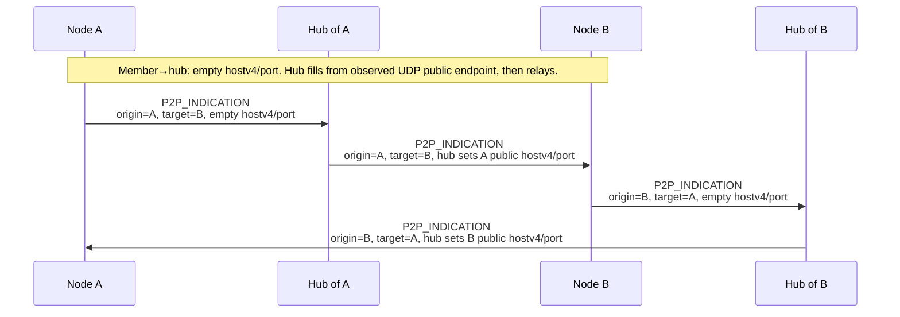

# BFC Tunneling Protocol

## 1 Core Concepts

### 1.1 Overview
* Extended star topology
* Overlay network
* Hub – publicly reachable nodes acting as default switches and NAT traversal helpers.
* Member - Nodes connecting to the hub, members are not publicly reachable (or opted not to).
* Hubs can connect each other to for an extended star.
* Members can form P2P to other members in the network through hub assisted NAT-traversal.

## 2 Message Framing
| Type        | Field       | Description         |
|-------------|-------------|---------------------|
| **static data**                                 |
| u4          | version     | Protocol Version    |
| u4          | type        | Messaged Type       |
| u8          | flag        | Flag bits           |
| u16         | ttl         | Time To Live        |
| u16         | size        | Message Data Size   |
| u128        | src         | Source Node ID      |
| u128        | dst         | Destination Node ID |
| **dynamic**                                     |
| *Message Payload*                               |

### 2.1 Version
* Major Protocol Version.
* Not compatible with other major version.

### 2.2 Node ID
Node ID is a 128-bit structure used to identify a node.
Node ID is not reusable, it is discarded if the network/transport
has changed (change udp endpoint).

The overlay uses one **shared node-ID space** across the interconnected network: `domain`, `csprng`, and `ts` are all part of the same address (the domain is not a separate namespace beside the node ID).

The `domain` field also defines an **implicit broadcast group** encoded in the address. To broadcast to all nodes in broadcast domain *D*, set the message’s destination node ID with `domain = D` and `ts = 0` (per the usual framing rules for `dst`).

| Size | Field  | Description                     |
|------|--------|---------------------------------|
| 8    | domain | Broadcast Domain                |
| 56   | csprng | Random                          |
| 64   | ts     | Epoch Time Stamp in nanoseconds |

### 2.3 Message Types
| Value | Name                        | Description                                                                                                |
|-------|-----------------------------|------------------------------------------------------------------------------------------------------------|
| 0x00  | ID_ANNOUNCE                 | Member announces its node ID to the hub (new and previous ID, seq, hub/delegation flags).                  |
| 0x00  | ID_CONFLICT                 | Hub tells the sender its claimed ID is already active on the overlay.                                      |
| 0x00  | LINK_INFO                   | Per-link counters and sender timestamp; heartbeat; peer replies immediately with its own report.           |
| 0x00  | LINK_REPORT                 | Derived link quality: timestamp plus receive drop estimate from peer `LINK_INFO` `snt_*` vs local `rcv_*`. |
| 0x00  | ROUTE_ANNOUNCE              | Propagates reachability: origin → next hop → target with announce sequence and path metric.                |
| 0x00  | HUB_ANNOUNCE                | Spreads a hub’s public IPv4 and UDP port after a hub identifies (from `ID_ANNOUNCE`).                      |
| 0x00  | P2P_INDICATION              | Hub-relayed reflexive UDP endpoints so peers can hole-punch toward each other.                             |
| 0x00  | NEIGHBOR_CANDIDATE_REQUEST  | Asks for candidate direct peers or endpoints (e.g. toward a target node).                                  |
| 0x00  | NEIGHBOR_CANDIDATE_RESPONSE | Supplies neighbor or endpoint candidates in reply to `NEIGHBOR_CANDIDATE_REQUEST`.                         |
| 0x00  | DISCOVER                    | Overlay discovery/query; semantics and payload are implementation-defined.                                 |
| 0x00  | DISCOVER_REPLY              | Response to `DISCOVER`.                                                                                    |
| 0x00  | TUNNEL_DATA                 | Encapsulated tunneled payload for the session (inner packet or stream data toward `dst`).                  |

## 3 Messages
### 3.1  ID_ANNOUNCE
Sent to hub to announce new id of the node.
Hub will drop packets if the node has not identified.

**Message Data**
| Size | Field  | Description      |
|------|--------|------------------|
| u128 | id     | Node ID          |
| u128 | old_id | Old Node ID      |
| u32  | sn     | Sequencer Number |
| u8   | flags  | Flags            |

**Flags**
| offset | Field       | Descrption         |
|--------|-------------|--------------------|
| 0      | is_hub      | Node is a hub      |
| 1      | delegated   | Delegated announce |

### 3.2 ID_CONFLICT
If ID is already existing in active nodes, hub will send ID_CONFLICT to the announcer.
Across interconnected hubs, peer hubs coordinate so no two active nodes share the same full 128-bit node ID.

**No Data Fields**

### 3.3 LINK_INFO
Carries link status from the sender’s perspective: when the snapshot was taken and cumulative receive/send packet and byte counts on this direct link. Periodic `LINK_INFO` exchange (with the mandatory reply below) also serves as a **heartbeat**: implementations SHOULD treat prolonged absence of queries from the peer as link or peer loss, using a local timeout policy.

On receipt, the peer MUST respond immediately with its own `LINK_INFO` using the same field layout and its current counters, so both ends obtain a paired snapshot for latency, loss, and throughput inference.

**Message Data**
| Size | Field       | Description                                                                 |
|------|-------------|-----------------------------------------------------------------------------|
| u64  | sender_time | Nanosecond timestamp from the sender’s clock when this report was built (monotonic time preferred). |
| u64  | rcv_pkt     | Packets received by the sender on this link since the counter epoch (e.g. link up or implementation-defined reset). |
| u64  | snt_pkt     | Packets sent by the sender on this link since the counter epoch.            |
| u64  | rcv_byt     | Bytes received by the sender on this link since the counter epoch.         |
| u64  | snt_byt     | Bytes sent by the sender on this link since the counter epoch.             |

### 3.4 LINK_REPORT
Conveys a **derived** view of link health at the sender: a timestamp plus an estimated receive loss rate. The sender computes `rx_drop_pct` by comparing the peer’s **`LINK_INFO`** `snt_pkt` and `snt_byt` (typically deltas between successive peer queries, or since a shared epoch) with its own **`rcv_pkt`** and **`rcv_byt`** over the same windows—gaps imply loss or reordering on the path into this node.

Typically sent soon after processing a peer `LINK_INFO` so the estimate references that message’s send counters together with the local receive counters.

**Message Data**
| Size | Field       | Description                                                                 |
|------|-------------|-----------------------------------------------------------------------------|
| u64  | sender_time | Nanosecond timestamp from the sender’s clock when this report was built (monotonic time preferred). |
| u16  | rx_drop_pct | Estimated receive loss in **basis points** (0–10000, where 10000 = 100%), from peer `LINK_INFO` `snt_*` vs local `rcv_*` as described above. |

### 3.5 ROUTE_ANNOUNCE
**Message Data**
| Size | Field    | Description              |
|------|----------|--------------------------|
| static data                                |
| u8   | count    | Number of entries        |
| dynamic data                               |
| *Entries*

**Entries**
| Size | Field    | Description              |
|------|----------|--------------------------|  
| u128 | origin   | Origin                   |
| u128 | next     | Next hop node            |
| u128 | target   | Target Node              |
| u16  | asn      | Announce sequence number |
| u16  | metric   | Path Metric              |

### 3.6 HUB_ANNOUNCE
Generated by hubs receiving the `ID_ANNOUNCE(is_hub=1)`.
Then propagated to members and peer hubs with `HUB_ANNOUNCE` to advertise new hub.

**Message Data**
| Size | Field    | Description                                            |
|------|----------|--------------------------------------------------------|
| u32  | addr4    | Hub’s public IPv4 address.                             |
| u16  | port     | UDP port for overlay traffic on that public interface. |

### 3.7 P2P_INDICATION
Hub-assisted hole punching: indications relay each peer’s reflexive public endpoint (`hostv4`, `port`); how endpoints are probed or kept open is local to implementations.

`hostv4`/`port` are **`origin`’s** public UDP endpoint **as seen toward `target`** (what `target` uses to punch). Members SHOULD send them empty to their hub; the hub MUST set them from the observed UDP source (or an equivalent member binding) before relaying toward `target`. A hub as `origin` SHOULD set them to its published overlay endpoint (same as `HUB_ANNOUNCE` for that interface). After a member-originated indication, later hops may source UDP from a hub while the payload still carries the filled reflexive endpoint; relays forward non-empty hub-`origin` values unless policy replaces them.

**Message Data**
| Size | Field    | Description                                            |
|------|----------|--------------------------------------------------------|
| u128 | origin   | Node ID of the peer whose endpoint is in `hostv4`/`port`. |
| u128 | target   | Node ID of the peer that should receive this indication. |
| u32  | hostv4   | Origin’s public IPv4. Empty on member→hub (hub sets before relay). Hub as `origin` SHOULD set directly. |
| u16  | port     | Origin’s UDP port for that IPv4. Empty on member→hub (hub sets before relay). Hub as `origin` SHOULD set directly. |

