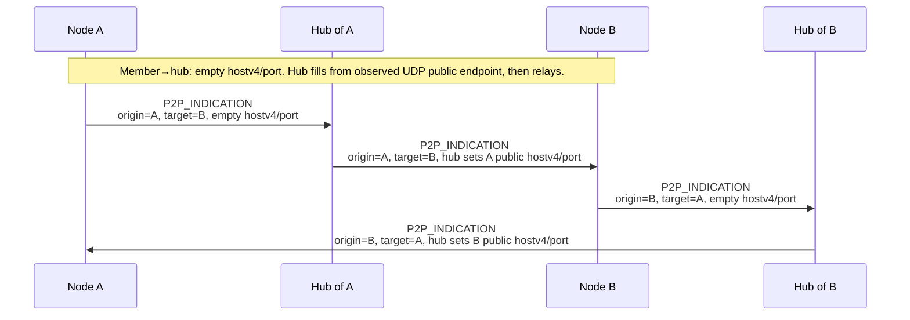
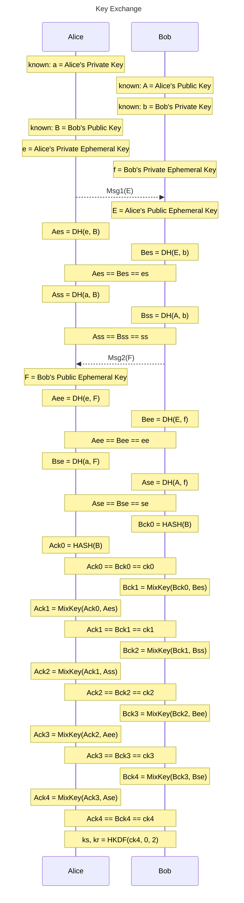

# BFC Tunneling Protocol

##  [Core] Core
### [Core.Overview] Overview
### [Core.Overview.Node] Node
A **node** is one overlay participant identified by **NodeID** in the shared address space; it exchanges framed messages over **local** and/or **global** transport. **Hubs** are publicly reachable members that anchor the global mesh and coordinate NAT traversal.

**Node attributes** are **H**, **A**, **L**, and **U** (Hub, Access, Local, Unassociated): public, NAT‑limited, local‑broadcast‑only, or disconnected reachability, as in the tables below.

| Attribute | Name  | Description                |
|----|--------------|----------------------------|
| H  | Hub          | Publicly reachable nodes   |
| A  | Access       | Nodes behind NAT           |
| L  | Local        | Nodes with local broadcast |
| U  | Unassociated | Nodes with no link         |

**Valid node attribute combinations** are exactly those listed in the table. Each row names a **node kind** (shorthand built from **H**, **A**, **L**, and **U**).

| Node | Local | Global |
|------|-------|--------|
| U    | no    | no     |
| A    | no    | nat    |
| H    | no    | public |
| L    | yes   | no     |
| LA   | yes   | nat    |
| LH   | yes   | public |

### [Core.Overview.SpecialLocalNodes] Special Local Nodes
Each **LA** or **LH** node creates a local broadcast domain, derives ephemeral confidentiality and integrity keys to protect traffic within that domain, and advertises itself as the domain host.

Each **L** node SHOULD obtain confidentiality and integrity keys for every domain it can observe, retrieving them from the corresponding domain host using ordinary unicast routing.

During bootstrap, an **L** node attempts to establish a secured unicast association with every visible peer. The first peer that can route toward the domain host forwards the initial key request. An **L** node MAY skip the request when the needed confidentiality and integrity keys are already present in memory.

### [Core.Overview.Mesh] Mesh
The overlay is organized as two complementary meshes. The **local transport mesh** is the set of nodes that can reach one another on local broadcast or similar local links. The **global transport mesh** is the wide-area fabric anchored by hubs (publicly reachable nodes) that interconnect NAT‑limited Access nodes across the internet. Hubs therefore coordinate NAT traversal for Access‑to‑Access paths so global legs can be established and maintained. Reachability and paths across these meshes use distance‑vector style updates, with split horizon and poison reverse to limit routing loops and propagate withdrawals cleanly.

* The local transport mesh groups nodes that are mutually reachable on local links.
* The global transport mesh is anchored by hubs that interconnect remote members.
* Hubs act as NAT traversal coordinators for Access‑to‑Access (A2A) links.
* Routing updates follow a distance-vector model with split horizon and poison reverse.

### [Core.Overview.Transport] Transport
**Local Transport**

Local transport delivers **BFC Tunnel Frames (BTF)** between nodes that share a **local broadcast domain** (or an equivalent multicast or shared‑medium segment), forming the **local transport mesh** described above without traversing the global hub fabric. The protocol specifies **BTF** as the common unit on this leg; how it is wrapped—WLAN broadcast data frames, radio PHY payloads, UDP multicast, and so on—is **link‑specific** and left to the implementation, while **BTF** fields such as **`lb`**, **`lb_domain`**, **`ttl`**, and **`src`/`dst`** carry the same overlay meaning regardless of the underlying medium.
 
**Examples**
* **WiFi injection** — the **BTF** occupies the 802.11 data frame body with the destination address set to broadcast. **Implementations** include *WInject-direct*, *wifibroadcast*, and *WFB-NG*.
* **SDR, Zigbee, and LoRa** — **BTF** is carried as the PHY payload (L2-equivalent). Radio management uses BTP RRC or manual configuration (implementation-defined).
* **UDP multicast** — **BTF** is the UDP payload. Multicast group and port are implementation-defined.

**Global Transport**

Global transport delivers **BFC Tunnel Frames (BTF)** across the **global transport mesh**: the wide-area fabric where **Hub** nodes are publicly reachable and **Access** nodes attach from behind NAT. The outer network is the ordinary Internet, using **IPv4** or **IPv6** endpoints and implementation-defined port or session binding (for example UDP endpoints associated with a node ID); **BTF** remains the inner unit whose fields carry the same overlay meaning as on local links. **Hubs** anchor this mesh and coordinate NAT traversal so **Access‑to‑Access** paths can be established and maintained alongside hub‑terminated traffic.

## [Core.Framing] Framing
### [Core.Framing.BTF] BFC Tunnel Frame
| Size | Type  | Field         | Description                    | Notes  |
|------|-------|---------------|--------------------------------|--------|
| 1    | `u8`  | `ttl`         | Time-to-live                   |        |
| -    | `u1`  | `security_en` | Security Enabled               |        |
| -    | `u1`  | `lb `         | Local Broadcast Message        |        |
| 1    | `u6`  | `version`     | Protocol Version               |        |
| s(x) | `x`   | `mac`         | Source Node Id                 | [1,2]  |
| -    | `u4`  | `conf_algo`   | Confidentiality Algorithm      | [1]    |
| 1    | `u4`  | `integ_algo`  | Integrity Protection Algorithm | [1]    |
| 1    | `u8`  | `lb_domain`   | Local Broadcast Domain         | [2]    |
| 4    | `u32` | `sn`          | Sequence Number                |        |
| 4    | `u32` | `ts`          | Epoch Second                   |        |
| 4    | `u32` | `src`         | Source NodeId                  |        |
| 4    | `u32` | `dst`         | Destination NodeId             |        |
| 2    | `u8`  | `payload_type`| Payload Type                   |        |
| N    | `u8[]`| `payload`     | Payload                        |        |

*Notes:* 
*1. `if set (security_en)`* 
*2. `x = mac_size(integ_algo)`* 
*3. `if set (lb)`* 

### [Core.Framing.BTF.fields] Fields

**`ttl`** — Hop limit for overlay forwarding. Each relay that forwards the frame on the local or global mesh MUST decrement `ttl` (or apply an equivalent policy); if `ttl` reaches zero before delivery to `dst`, the frame MUST be dropped. This limits routing loops and excessive fan-out.

**`security_en`** — When **1**, the frame includes **`cipher_algo`**, **`integ_algo`**, and a **`mac`** whose length is **`mac_size(integ_algo)`** (note *1*). When **0**, those fields are omitted and the payload is not protected by this framing’s cipher/MAC.

**`lb`** — When **1**, the frame is a **local-broadcast** message: it is scoped to local transport and the **`lb_domain`** selector (note *3*). When **0**, the frame follows unicast delivery rules for `dst`.

**`version`** — **Major** protocol version for this frame. Receivers MUST reject frames whose `version` does not match the implementation’s supported major version (major versions are not interoperable).

**`mac`** — **Message authentication / integrity tag** over the authenticated portion of the frame, present only when **`security_en` = 1**; length **`x`** bytes with **`x = mac_size(integ_algo)`** (notes *1* and *2*). Receivers MUST verify `mac` before accepting the frame. *(The framing table’s “Source Node Id” label is the sender identity field **`src`**, not this tag.)*

**`conf_algo`** — Code selecting the **confidentiality** algorithm for the protected payload; present only when **`security_en` = 1** (note *1*).

**`integ_algo`** — Code selecting the **integrity** algorithm; defines **`mac`** length via **`mac_size(integ_algo)`** when **`security_en` = 1** (notes *1* and *2*).

**`lb_domain`** — Selects which **local broadcast domain** this frame belongs to on local transport (see **Local Transport** and **Special Local Nodes** above). Each **LA** or **LH** node creates a domain and acts as its **domain host**; **L** nodes MAY observe multiple domains and therefore MUST use **`lb_domain`** to pick the correct per-domain keys when handling **`lb` = 1** traffic. When **`lb` = 1**, senders MUST set **`lb_domain`** to the identifier of the domain on which the frame is transmitted, and it MUST be consistent with link configuration and with keys distributed by that domain’s host. When **`security_en` = 1** on such a frame, confidentiality and integrity processing MUST use the key material for that **`lb_domain`**.

**`sn`** — Sender sequence number for this `(src, dst)` (or implementation-defined scope). Used for deduplication, ordering, and replay control; monotonic assignment is RECOMMENDED within each scope.

**`ts`** — Sender timestamp: **seconds** since the Unix epoch (`time_t` resolution), UTC or sender-local as long as all peers agree on interpretation for freshness checks.

**`src`** — Overlay identity of the **sender**.

**`dst`** — Overlay identity of the **intended recipient** for unicast frames.

**`payload_type`** — Discriminator for the layout and meaning of **`payload`**
**`payload`** — Variable-length octets interpreted according to **`payload_type`**.

# WIP -IGNORE BELOW
------------------

### 2.3 Message Types
The `type` field in §2 framing is **4 bits** (`u4`); values below are the numeric codes for each payload layout in §3.

| Value | Name           | Description                                                                                                        |
|-------|----------------|--------------------------------------------------------------------------------------------------------------------|
| 0x00  | ID_REQUEST     | Member asks the hub for a node ID; payload `domain` and `flags` (§3.1).                                            |
| 0x01  | ID_RESPONSE    | Hub assigns a node ID and returns it (plus echoed `flags`) to the member (§3.2).                                   |
| 0x02  | LINK_INFO      | Per-link counters and sender timestamp; acts as a heartbeat; peer MUST reply at once with its own snapshot (§3.3). |
| 0x03  | LINK_REPORT    | Derived link quality: timestamp and receive-drop estimate from peer `LINK_INFO` `snt_*` vs local `rcv_*` (§3.4).   |
| 0x04  | ROUTE_ANNOUNCE | Reachability propagation: `origin` → next hop → `target` with announce sequence and path metric (§3.5).            |
| 0x05  | HUB_ANNOUNCE   | Announces hub overlay identity to members and peer hubs so clients learn hub `NodeID` entries; layout §3.6.        |
| 0x06  | P2P_INDICATION | Hub-assisted hole punching: reflexive public UDP endpoint for `origin` as seen toward `target` (§3.7).             |
| 0x07  | TUNNEL_DATA    | Encapsulated payload for the tunnel session (inner packet or stream data toward `dst`).                            |

## 3 Messages
### 3.1 ID_REQUEST
Sent to hub to request a node ID. Node ID is associated with its outer-network address.
If the network address has changed, the node ID is invalidated.

**Message Data**
| Size | Field  | Description                                                                                       |
|------|--------|---------------------------------------------------------------------------------------------------|
| u64  | id     | Request ID (csprng), when the request is delegated this will be used to determine the return path |
| u8   | domain | Broadcast Domain                                                                                  |
| u8   | flags  | Flags                                                                                             |

**Flags**
| offset | Field       | Description        |
|--------|-------------|--------------------|
| 0      | is_hub      | Node is a hub      |
| 1      | delegated   | Delegated request  |

There are cases that a joining member only have an access to a node in the network.
In this case, the joining member can connect and request id to its local neighbor node and sends a delegated request id to the hub.

### 3.2 ID_RESPONSE
Hub reply to `ID_REQUEST`. Carries the **assigned** overlay node ID for this member’s current outer UDP binding. The member MUST adopt `node_id` as its `src` (and in all subsequent framed messages) until the outer address changes, at which point the ID is invalidated per §2.2 / §3.1.

**Message Data**
| Size | Field   | Description       |
|------|---------|-------------------|
| u64  | id      | Response ID       |
| u8   | status  | Status Code       |
| u128 | node_id | Allocated node ID |

**Status Code**
| Value | Name   | Description                                                                                                |
|-------|--------|-------------------------------------------------------------------------|
| 0x00  | OK     | Node ID allocated.                                                      |
| 0x01  | NO_NET | `ID_REQUEST` can't be delegated because the node is not in the network. |
| 0xFF  | UNSPEC | Unspecified Error                                                       |

### 3.3 LINK_INFO
Carries link status from the sender’s perspective: when the snapshot was taken and cumulative receive/send packet and byte counts on this direct link. Periodic `LINK_INFO` exchange (with the mandatory reply below) also serves as a **heartbeat**: implementations SHOULD treat prolonged absence of queries from the peer as link or peer loss, using a local timeout policy.

On receipt, the peer MUST respond immediately with its own `LINK_INFO` using the same field layout and its current counters, so both ends obtain a paired snapshot for latency, loss, and throughput inference.

**Message Data**
| Size | Field       | Description                                                                 |
|------|-------------|-----------------------------------------------------------------------------|
| u64  | sender_time | Nanosecond timestamp from the sender’s clock when this report was built (monotonic time preferred). |
| u64  | rcv_pkt     | Packets received by the sender on this link since the counter epoch (e.g. link up or implementation-defined reset). |
| u64  | snt_pkt     | Packets sent by the sender on this link since the counter epoch.            |
| u64  | rcv_byt     | Bytes received by the sender on this link since the counter epoch.         |
| u64  | snt_byt     | Bytes sent by the sender on this link since the counter epoch.             |

### 3.4 LINK_REPORT
Conveys a **derived** view of link health at the sender: a timestamp plus an estimated receive loss rate. The sender computes `rx_drop_pct` by comparing the peer’s **`LINK_INFO`** `snt_pkt` and `snt_byt` (typically deltas between successive peer queries, or since a shared epoch) with its own **`rcv_pkt`** and **`rcv_byt`** over the same windows—gaps imply loss or reordering on the path into this node.

Typically sent soon after processing a peer `LINK_INFO` so the estimate references that message’s send counters together with the local receive counters.

**Message Data**
| Size | Field       | Description                                                                 |
|------|-------------|-----------------------------------------------------------------------------|
| u64  | sender_time | Nanosecond timestamp from the sender’s clock when this report was built (monotonic time preferred). |
| u16  | rx_drop_pct | Estimated receive loss in **basis points** (0–10000, where 10000 = 100%), from peer `LINK_INFO` `snt_*` vs local `rcv_*` as described above. |

### 3.5 ROUTE_ANNOUNCE
**Message Data**
| Size | Field    | Description              |
|------|----------|--------------------------|
| **static data**                            |
| u16  | asn      | Announce sequence number |
| u16  | page     | Current page number      |
| u16  | total    | Total page number        |
| u8   | flags    | Flags                    |
| u8   | count    | Number of entries        |
| **dynamic data**                           |
| *Entries*                                  |

**Flags**
| offset | Field       | Description         |
|--------|-------------|---------------------|
| 0      | is_snapshot | Snapshot            |

**Entry**
| Size | Field    | Description              |
|------|----------|--------------------------|
| u128 | origin   | Origin                   |
| u128 | next     | Next hop node            |
| u128 | target   | Target node              |
| u16  | metric   | Path Metric              |

### 3.6 HUB_ANNOUNCE
Generated by hubs receiving the `ID_REQUEST(is_hub=1)`,
then propagated to members and peer hubs with `HUB_ANNOUNCE` to advertise new hub.
It is also sent (with `sn=0`) to any new node connecting to the network.
If same announcer and sequencer number has been already received, ignore.
It may also be generated periodically by hubs.

**Message Data**
| Size | Field    | Description         |
|------|----------|---------------------|
| **static**                            |
| u128 | origin   | Announcer           |
| u64  | sn       | Sequence Number     |
| u16  | page     | Current page number |
| u16  | total    | Total page number   |
| u8   | flags    | Flags               |
| u8   | count    | Number of entries   |
| **dynamic data**                      |
| *Entries*                             |

**Flags**
| offset | Field       | Description    |
|--------|-------------|----------------|
| 0      | is_snapshot | Snapshot       |

**Entry**
| Size | Field    | Description         |
|------|----------|---------------------|
| u128 | NodeID   | Node ID of the hub  |

### 3.7 P2P_INDICATION
Hub-assisted hole punching: indications relay each peer’s reflexive public endpoint (`hostv4`, `port`); how endpoints are probed or kept open is local to implementations.

`hostv4`/`port` are **`origin`’s** public UDP endpoint **as seen toward `target`** (what `target` uses to punch). Members SHOULD send them empty to their hub; the hub MUST set them from the observed UDP source (or an equivalent member binding) before relaying toward `target`. A hub as `origin` SHOULD set them to its published overlay endpoint (same as `HUB_ANNOUNCE` for that interface). After a member-originated indication, later hops may source UDP from a hub while the payload still carries the filled reflexive endpoint; relays forward non-empty hub-`origin` values unless policy replaces them.

**Message Data**
| Size | Field    | Description                                            |
|------|----------|--------------------------------------------------------|
| u128 | origin   | Node ID of the peer whose endpoint is in `hostv4`/`port`. |
| u128 | target   | Node ID of the peer that should receive this indication. |
| u32  | hostv4   | Origin’s public IPv4. Empty on member→hub (hub sets before relay). Hub as `origin` SHOULD set directly. |
| u16  | port     | Origin’s UDP port for that IPv4. Empty on member→hub (hub sets before relay). Hub as `origin` SHOULD set directly. |

## 4 Discovery

Discovery is how a node learns **who exists**, **which hub completes bootstrap `ID_REQUEST` / `ID_RESPONSE`**, and **how to obtain direct UDP punch targets**.

### 4.1 Bootstrap, hub, and identity discovery

Members are configured with a **list of hub UDP endpoints** `(addr4, port)` and attempt them until one is reachable.
The member sends **`ID_REQUEST`** (§3.1) to the hub.
The hub replies with **`ID_RESPONSE`** (§3.2):
on status **`OK`**, the member adopts the returned `node_id`; on **`NO_NET`**, a delegated request could not reach the network (§3.1). A non-**`OK`** **`ID_RESPONSE`** is the negative discovery path for that attempt: the member must not treat the overlay as having allocated a node ID until it receives **`OK`** and adopts the returned `node_id`.

A member learns that the overlay **accepts its node ID** from that successful **`ID_RESPONSE` (`OK`)** after its **single** bootstrap **`ID_REQUEST`** to the chosen hub (§3.1–§3.2). The bootstrap hub’s **`HUB_ANNOUNCE`** lets the member learn other hubs’ node id and may open **direct outer UDP** toward them when needed (e.g. using `P2P_INDICATION` for hole punching).

Across interconnected hubs, **no two active nodes share the same full node ID**; hub coordination is part of making “who is this ID?” consistent network-wide.

### 4.2 P2P endpoint discovery

`P2P_INDICATION` gives each side the peer’s reflexive public `(hostv4, port)` (§3.7)—the outer UDP addresses used for hole punching. Hubs fill or relay those values; probes and keepalives are implementation-defined.

## 5 Routing

Routing is how a node decides **where to send a framed message next** so it reaches its `dst`—whether another member, a hub, or a broadcast domain.

### 5.1 Distance vector with poison reverse

**Distance vector** routing means each node maintains, for every reachable overlay destination, a **best path** consisting of a **metric** (cost) and a **next hop**. Neighbors exchange these facts in **`ROUTE_ANNOUNCE`** entries (§3.5): `target` is the destination, `metric` is the path cost from the announcer’s perspective, `next` is the successor the receiver should use if it installs the route, and `origin` scopes who originated the update.

**Poison reverse** (often called **reverse poison** in the split-horizon literature) is a rule for what to send **on each neighbor link** so failures do not cause long-lived loops or slow “count to infinity”:

- **Split horizon:** A node avoids advertising a route to `target` back out on the same link that is its **current next hop** to `target`, because that neighbor already lies on the path; echoing the route can make both sides depend on each other for the same prefix after a break.

- **Poison reverse:** When split horizon would suppress that advertisement, the node **still** sends an update on that link, but with **`metric`** set to an **unreachable** sentinel (implementation-defined maximum; receivers treat it as “not viable via this announcer on this path”). The neighbor then drops the stale path through you at once instead of waiting for timeouts.

Together, distance-vector updates plus split horizon with poison reverse are the usual way to keep **`ROUTE_ANNOUNCE`** propagation convergent on hub/member meshes without requiring a global link-state database.

## 2 Basic  Security
### 2.1 Key Exchange
