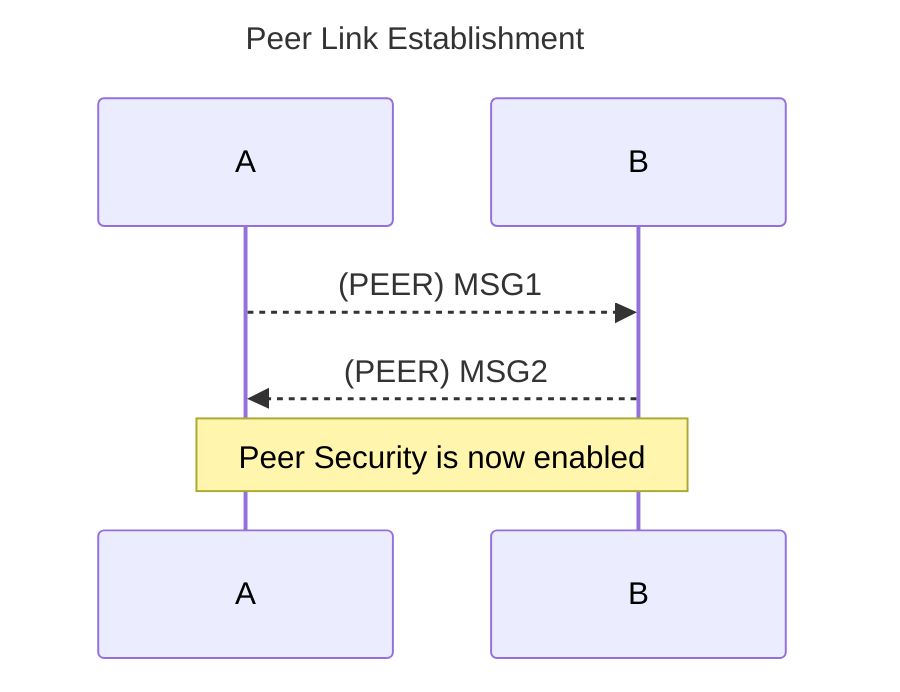
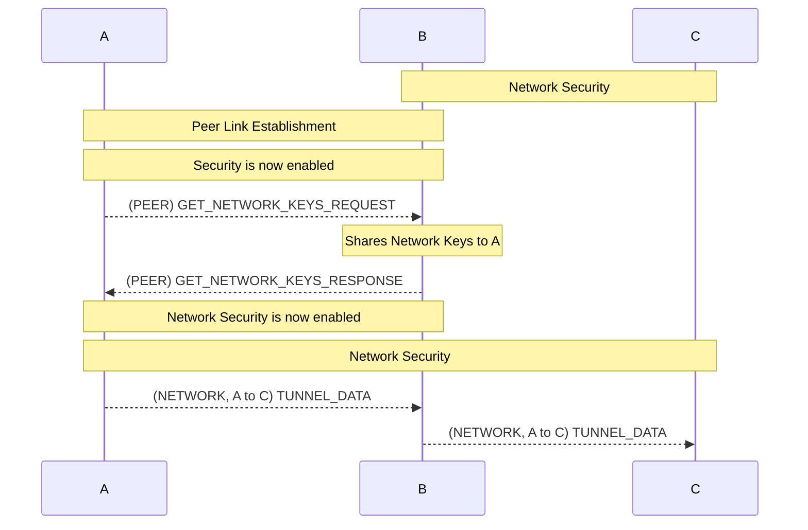
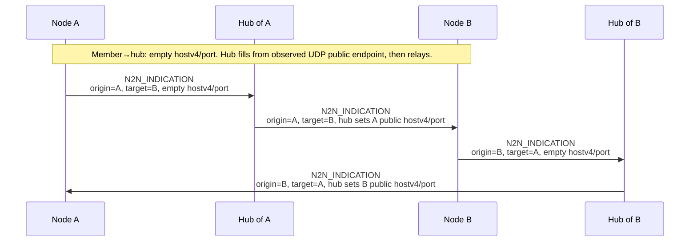
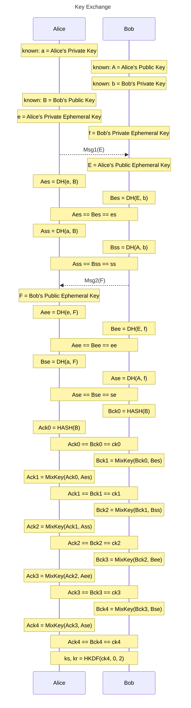

# BFC Tunneling Protocol

##  [Core] Core

### [Core.Overview] Overview

---

### [Core.Overview.Node] Node

---

A **node** is an overlay participant identified by a **NodeID** in the shared address space. A node exchanges framed messages over **local** and/or **global** transport. **Hubs** are publicly reachable nodes in the global mesh. **Access** nodes are configured with hub endpoints for initial global attachment.

---

**Node attributes** are **H**, **A**, **L**, and **U** (Hub, Access, Local, Unassociated): public, NAT‑limited, local‑broadcast‑only, or disconnected reachability, as in the tables below.

| Attribute | Name  | Description                |
|----|--------------|----------------------------|
| H  | Hub          | Publicly reachable nodes   |
| A  | Access       | Nodes behind NAT           |
| L  | Local        | Nodes with local broadcast |
| U  | Unassociated | Nodes with no link         |

---

**Valid node attribute combinations** are exactly those listed in the table. Each row names a **node kind** (shorthand built from **H**, **A**, **L**, and **U**).

| Node | Local | Global |
|------|-------|--------|
| U    | no    | no     |
| A    | no    | nat    |
| H    | no    | public |
| L    | yes   | no     |
| LA   | yes   | nat    |
| LH   | yes   | public |

---

### [Core.Overview.Mesh] Mesh

---

The overlay is modeled as two complementary meshes. The **local transport mesh** consists of nodes that are mutually reachable over local broadcast or similar local links. The **global transport mesh** consists of wide-area reachability over IP networks. **Hubs** provide bootstrap entry into the global mesh: an **Access** node uses only configured hub endpoints for its initial global-transport join. After at least one global path is operational, non-hub members can relay overlay traffic and can assist **N2N** (*node-to-node transport availability*). **N2N** defines transport-path enablement only and is distinct from **P2P peer-link establishment**, which remains a separate security/keying phase. Hubs are the typical initial **anchor** for N2N, but any peer with established global transport relationships to both parties can relay or originate N2N assistance; a node that has established direct global connectivity to another member can in turn act as an anchor for additional members. Reachability and path propagation across both meshes follow a distance-vector model with split horizon and poison reverse to reduce loops and propagate withdrawals.

* The local transport mesh groups nodes that are mutually reachable on local multicast/broadcast links.
* The global transport mesh is bootstrapped through hubs; Access nodes attach globally via hub endpoints first.
* **N2N** arranges **transport** reachability; **P2P** remains a separate secured peer-link establishment phase.
* Hubs and other global-transport peers can coordinate NAT traversal and N2N; routing updates follow a distance-vector model with split horizon and poison reverse.

---

### [Core.Overview.Transport] Transport

---

Local and global transport use different media but are equivalent for **BFC Tunnel Frame (BTF)** carriage and forwarding. **BTF** may traverse any reachable overlay path regardless of hop medium. Local links may apply link-specific outer encapsulation (for example, WLAN broadcast frames, radio PHY payloads, or UDP multicast) without changing **BTF** semantics. **N2N_INDICATION** is only for IP endpoint signaling (`hostv4`/`port`) during global UDP path setup; nodes on the same local broadcast domain can still have **N2N** transport availability without IP transport identity or **N2N_INDICATION** exchange.

* **Local Transport** carries **BTF** across the **local transport mesh** over local broadcast or equivalent shared-medium links.
    * **WiFi injection** — the **BTF** occupies the 802.11 data frame body with the destination address set to broadcast. **Implementations** include *WInject-direct*, *wifibroadcast*, and *WFB-NG*.
    * **SDR, Zigbee, and LoRa** — **BTF** is carried as the PHY payload (L2-equivalent). Radio management uses BTP RRC or manual configuration (implementation-defined).
    * **UDP multicast** — **BTF** is the UDP payload. Multicast group and port are implementation-defined.
* **Global Transport** carries **BTF** across the **global transport mesh** over ordinary Internet **IPv4** or **IPv6** paths.

---

## [Core.Framing] Framing

### [Core.Framing.BTF] BFC Tunnel Frame
| Size | Type  | Field         | Description                    | Notes  |
|------|-------|---------------|--------------------------------|--------|
| 1    | `u1`  | `reserved`    | Reserved                       |        |
| -    | `u5`  | `version`     | Protocol Version               |        |
| -    | `u2`  | `frame_type`  | Frame Type                     |        |
| 1    | `u8`  | `sec_ctx`     | Security Context               |        |
| 1    | `u8`  | `ttl`         | Time-to-live                   |        |
| 1    | `u4`  | `conf_algo`   | Confidentiality Algorithm      |        |
| -    | `u4`  | `inte_algo`   | Integrity Protection Algorithm |        |
| s(x) | `x`   | `mac`         | Message Authentication Code    | [1]    |
| 4    | `u32` | `sn`          | Sequence Number                |        |
| 4    | `u32` | `ts`          | Epoch Second                   |        |
| 4    | `u32` | `src`         | Source NodeId                  |        |
| 4    | `u32` | `dst`         | Destination NodeId             |        |
| N    | `u8[]`| `payload`     | Payload                        |        |

*Notes:*<br/>
*1. `x = mac_size(integ_algo)`*<br/>

---

**Frame Types**

Frame types include *Peer*, which is used in bootstrapping network configuration and security and is not routable; *Network*, which is used for routing and data delivery;**, which allows a node to pass a secured message through a peer when network security is not yet available; and Public, which is used for node beacon messages.

| Value | Name              | Description |
|-------|-------------------|-------------|
| 0     | PEER              | Message intended for direct distination (i.e: TTL==1, next_hop==target)|
| 1     | NETWORK           | Message intended for the network.|
| 2     | NETWORK_OVER_PEER | Message intended for the network delegated by a peer.|
| 3     | PUBLIC            | Message intended for public. |

### [Core.Framing.BTF.fields] Fields
Fields are encoded in network byte order (big-endian). Bit-fields that share a byte are packed most-significant-bit first as shown in the table.

- `version` MUST match the negotiated protocol version.
- `frame_type` selects the frame interpretation.
- `sec_ctx` selects the active keying/material profile used to validate and decrypt the frame.
- `ttl` is decremented by each forwarding hop, and frames reaching `ttl = 0` MUST be dropped.
- `conf_algo` and `inte_algo` identify the confidentiality and integrity transforms for this frame.
- `mac` length is derived from `inte_algo` (`mac_size(integ_algo)`).
- `sn` and `ts` provide replay-window and freshness inputs.
- `src` and `dst` are overlay Node IDs used for routing and policy checks.
- `payload` frame payload.

---

## [Core.Flows] Flows

### [Core.Flows.PeerLinkEstablishment] Peer Link Establishment

---

Each node in the mesh maintains public keys for all the other nodes in the mesh.
It is used for key exchange to generate keys for peer security.  



---

### [Core.Flows.NetworkLinkEstablishment] Network Link Establishment

---


---

## [Core.Messages] Mesages

### [Core.Messages.MessageDefinition] Message Definition

---

**Beacon**

Sent on all transport types to identify active neighboring nodes.

**Message Data**
| Size | Field       | Description                                                                 |
|------|-------------|-----------------------------------------------------------------------------|
| u32  | node_id     |  |

---

**Msg1 and Msg2**
```
type key_t dynamic_array=256, type = u8  

sequence msg1
{
    key_t ephemeral,
    key_t signature
};

sequence msg2
{
    key_t ephemeral,
    key_t signature
};
```

---

**Link Info and Link Report**
```
sequence link_info
{
    u64 sender_time_us,
    u64 rcv_pkt,
    u64 snt_pkt,
    u64 rcv_byt,
    u64 snt_byt
};

sequence link_report
{
    u64 sender_time_us,
    u16 rx_drop_pct
};
```

---

**Route Announce**

```
sequence route_announce_entry
{
    u32 origin_node_id,
    u32 next_node_id,
    u32 target_node_id,
    u16 path_metric
};

type route_announce_entries         type = route_announce_entry, dynamic_array = 256;

sequence route_announce
{
    u16 announcement_number,
    u16 current_page,
    u16 total_page,
    u8 flags,
    route_announce_entries routes
};
```

---

```
choice BTPMessage
{
    beacon,
    msg1,transport-0.peer-0.
    msg2,
    link_info,
    link_report,
    route_announce,
    n2n_indication
};

```

# WIP - IGNORE BELOW
------------------

### [Core.Messages.MessageTypes] Message Types

---

| Value | Frame   | Name           | Description                                                                                                        |
|-------|---------|----------------|--------------------------------------------------------------------------------------------------------------------|
| 0x00  | PUBLIC  | BEACON         | Used to broadcast active NodeId                                                                                    |
| 0x01  | PEER    | MSG1           | Used to send initiator's emphemeral key.                                                                           |
| 0x02  | PEER    | MSG2           | Used to send responder's emphemeral key.                                                                           |
| 0x03  | PEER    | LINK_INFO      | |
| 0x04  | PEER    | LINK_REPORT    | |

| 0x04  | NETWORK | ROUTE_ANNOUNCE | |
| 0x05  | NETWORK | HUB_ANNOUNCE   | |
| 0x06  | NETWORK | N2N_INDICATION | |
| 0x07  | NETWORK | TUNNEL_DATA    | |

### 3.3 LINK_INFO
Carries link status from the sender’s perspective: when the snapshot was taken and cumulative receive/send packet and byte counts on this direct link. Periodic `LINK_INFO` exchange (with the mandatory reply below) also serves as a **heartbeat**: implementations SHOULD treat prolonged absence of queries from the peer as link or peer loss, using a local timeout policy.

On receipt, the peer MUST respond immediately with its own `LINK_INFO` using the same field layout and its current counters, so both ends obtain a paired snapshot for latency, loss, and throughput inference.

**Message Data**
| Size | Field       | Description                                                                 |
|------|-------------|-----------------------------------------------------------------------------|
| u64  | sender_time | Nanosecond timestamp from the sender’s clock when this report was built (monotonic time preferred). |
| u64  | rcv_pkt     | Packets received by the sender on this link since the counter epoch (e.g. link up or implementation-defined reset). |
| u64  | snt_pkt     | Packets sent by the sender on this link since the counter epoch.            |
| u64  | rcv_byt     | Bytes received by the sender on this link since the counter epoch.         |
| u64  | snt_byt     | Bytes sent by the sender on this link since the counter epoch.             |

### 3.4 LINK_REPORT
Conveys a **derived** view of link health at the sender: a timestamp plus an estimated receive loss rate. The sender computes `rx_drop_pct` by comparing the peer’s **`LINK_INFO`** `snt_pkt` and `snt_byt` (typically deltas between successive peer queries, or since a shared epoch) with its own **`rcv_pkt`** and **`rcv_byt`** over the same windows—gaps imply loss or reordering on the path into this node.

Typically sent soon after processing a peer `LINK_INFO` so the estimate references that message’s send counters together with the local receive counters.

**Message Data**
| Size | Field       | Description                                                                 |
|------|-------------|-----------------------------------------------------------------------------|
| u64  | sender_time | Nanosecond timestamp from the sender’s clock when this report was built (monotonic time preferred). |
| u16  | rx_drop_pct | Estimated receive loss in **basis points** (0–10000, where 10000 = 100%), from peer `LINK_INFO` `snt_*` vs local `rcv_*` as described above. |

### 3.5 ROUTE_ANNOUNCE
**Message Data**
| Size | Field    | Description              |
|------|----------|--------------------------|
| **static data**                            |
| u16  | asn      | Announce sequence number |
| u16  | page     | Current page number      |
| u16  | total    | Total page number        |
| u8   | flags    | Flags                    |
| u8   | count    | Number of entries        |
| **dynamic data**                           |
| *Entries*                                  |

**Flags**
| offset | Field       | Description         |
|--------|-------------|---------------------|
| 0      | is_snapshot | Snapshot            |

**Entry**
| Size | Field    | Description              |
|------|----------|--------------------------|
| u128 | origin   | Origin                   |
| u128 | next     | Next hop node            |
| u128 | target   | Target node              |
| u16  | metric   | Path Metric              |

### 3.7 N2N_INDICATION
**N2N** (*node-to-node transport availability*) is a transport property that can exist on both local and global media. **N2N_INDICATION** is the IP-based signaling message used to exchange reflexive public endpoints (`hostv4`, `port`) for UDP hole punching, so the **outer transport** for a direct global leg can be attempted. It does **not** replace **P2P** peer-link establishment: after endpoint signaling, nodes still run the PEER security exchange (`MSG1` / `MSG2`, *Peer Link Establishment* above) to establish the peer-cryptographic link.

The first N2N exchange for an **Access** node is typically **anchored** at a **hub** (the bootstrap peer). Any member that already has **global transport** to both `origin` and `target` may relay or assist N2N in the same way, including a peer that only gained that role after its own **P2P** peer link was established. How endpoints are probed or keepalives are sent is implementation-defined.

`hostv4`/`port` are **`origin`’s** public UDP endpoint **as seen toward `target`** (what `target` uses to punch). Members SHOULD send them empty to their assisting peer (often a hub); the relay MUST set them from the observed UDP source (or an equivalent member binding) before forwarding toward `target`. A hub as `origin` SHOULD set them to its published overlay endpoint (same as `HUB_ANNOUNCE` for that interface). After a member-originated indication, later hops may source UDP from a hub while the payload still carries the filled reflexive endpoint; relays forward non-empty hub-`origin` values unless policy replaces them.

**Message Data**
| Size | Field    | Description                                            |
|------|----------|--------------------------------------------------------|
| u128 | origin   | Node ID of the peer whose endpoint is in `hostv4`/`port`. |
| u128 | target   | Node ID of the peer that should receive this indication. |
| u32  | hostv4   | Origin’s public IPv4. Empty on member→hub (hub sets before relay). Hub as `origin` SHOULD set directly. |
| u16  | port     | Origin’s UDP port for that IPv4. Empty on member→hub (hub sets before relay). Hub as `origin` SHOULD set directly. |



## 4 Discovery

Placeholder

## 5 Routing

Routing is how a node decides **where to send a framed message next** so it reaches its `dst`—whether another member, a hub, or a broadcast domain.

### 5.1 Distance vector with poison reverse

**Distance vector** routing means each node maintains, for every reachable overlay destination, a **best path** consisting of a **metric** (cost) and a **next hop**. Neighbors exchange these facts in **`ROUTE_ANNOUNCE`** entries (§3.5): `target` is the destination, `metric` is the path cost from the announcer’s perspective, `next` is the successor the receiver should use if it installs the route, and `origin` scopes who originated the update.

**Poison reverse** (often called **reverse poison** in the split-horizon literature) is a rule for what to send **on each neighbor link** so failures do not cause long-lived loops or slow “count to infinity”:

- **Split horizon:** A node avoids advertising a route to `target` back out on the same link that is its **current next hop** to `target`, because that neighbor already lies on the path; echoing the route can make both sides depend on each other for the same prefix after a break.

- **Poison reverse:** When split horizon would suppress that advertisement, the node **still** sends an update on that link, but with **`metric`** set to an **unreachable** sentinel (implementation-defined maximum; receivers treat it as “not viable via this announcer on this path”). The neighbor then drops the stale path through you at once instead of waiting for timeouts.

Together, distance-vector updates plus split horizon with poison reverse are the usual way to keep **`ROUTE_ANNOUNCE`** propagation convergent on hub/member meshes without requiring a global link-state database.

## 2 Basic  Security
### 2.1 Key Exchange
